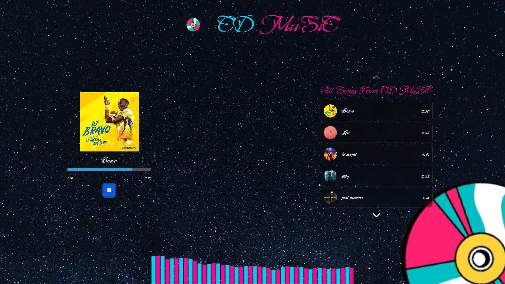

# django-Flask
Django and flask project of mine
## 🎵 Project Preview

 🚀 *Key Features:*

 🌐 *Web-based:* Access your music player from anywhere with an internet connection.
💾 *Database Design:* Learn to structure your music library efficiently.
🔐 *User Authentication:* Securely manage user accounts and preferences.
🚀 *Real-Time Lyric Sync:* Enjoy the magic of lyrics in sync with the music.
🧑‍💻 *User-Friendly Interface:* Craft an engaging and dynamic experience for your users.
